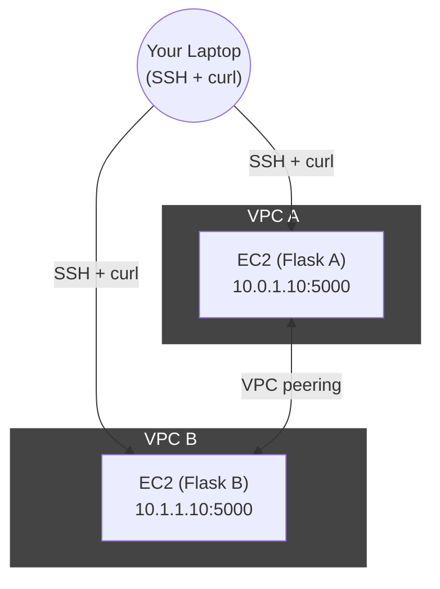

<div align="center">
  <h1>VPC Peering Lab</h1>
  <p><strong>Hands-on AWS VPC Peering with Flask and MongoDB Atlas</strong></p>
  
</div>

---

## Table of Contents

- [Project Overview](#project-overview)
- [Architecture](#architecture)
- [Prerequisites](#prerequisites)
- [Usage](#usage)
  - [Initialize Terraform](#initialize-terraform)
  - [Deploy](#deploy)
  - [Verification](#verification)
  - [Cleanup](#cleanup)
- [Next Steps: Integrating MongoDB Atlas with VPC Peering](#next-steps-integrating-mongodb-atlas-with-vpc-peering)

---

## Project Overview

This repository demonstrates how to set up AWS VPC Peering between two VPCs, each running a simple Flask application on EC2 instances. The lab guides you through provisioning, verification, and cleanup, and provides a path to extend the setup with MongoDB Atlas and VPC peering.

---

## Architecture


The project creates two VPCs, peering between them, and an EC2 instance in each VPC running a simple Flask app.




Both instances run a Flask app on port 5000 and can reach each other privately.

---

## Prerequisites

Install the following on your machine:

- **Terraform**
  ```bash
  brew tap hashicorp/tap
  brew install hashicorp/tap/terraform
  ```
- **AWS CLI**
  ```bash
  brew install awscli
  ```
- **AWS Credentials**
  Ensure your AWS credentials are set up. Verify with:
  ```bash
  aws sts get-caller-identity
  ```
- **EC2 SSH Key Pair**
  ```bash
  aws ec2 create-key-pair \
    --key-name vpc-lab \
    --query "KeyMaterial" \
    --output text > vpc-lab.pem
  chmod 400 vpc-lab.pem
  ```

---

## Usage

Navigate into the Terraform directory:

```bash
cd terraform
```

### Initialize Terraform

```bash
terraform init
```

If needed, you can also re-configure terraform using:

```bash
terraform init -reconfigure
```

### Deploy

Get your public IP:

```bash
MY_IP=$(curl -s https://checkip.amazonaws.com)
```

Apply the configuration:

```bash
terraform apply \
  -var "aws_region=us-east-1" \
  -var "my_ip=${MY_IP}" \
  -var "key_name=vpc-lab"
```

### Verification

Retrieve outputs:

```bash
terraform output
```

SSH into EC2 in VPC A using:

```bash
ssh -i ../vpc-lab.pem ec2-user@$(terraform output -raw vpc_a_instance_public_ip)
```

Once inside VPC A, you can attempt to curl into VPC B using:

```bash
curl http://<INSERT VPC B PRIVATE IP HERE>:5000
```

The expected output is:

```bash
Hello from VPC B!
```

You can also verify the peering connection works from VPC B to VPC A.

### Cleanup

To destroy all resources:

```bash
terraform destroy \
  -var "aws_region=us-east-1" \
  -var "my_ip=${MY_IP}" \
  -var "key_name=vpc-lab"
```

---

## Next Steps: Integrating MongoDB Atlas with VPC Peering

In the next section of this lab, we will extend the current setup to include a MongoDB Atlas cluster. The goal is to establish VPC peering between your AWS VPC and the MongoDB Atlas VPC, allowing secure, private connectivity between your Flask application and the managed database.

### Objectives

- Deploy a MongoDB Atlas cluster in a dedicated VPC.
- Configure VPC peering between your AWS VPC and the MongoDB Atlas VPC.
- Update the Flask application to connect to the MongoDB Atlas database using the private connection.
